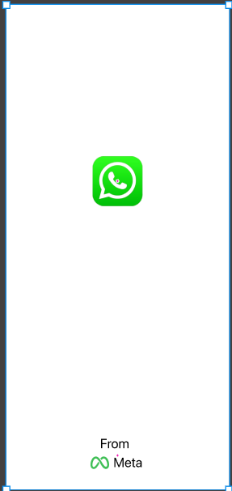
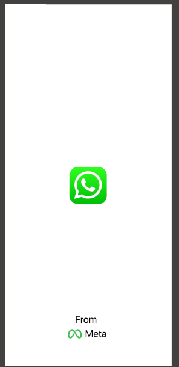
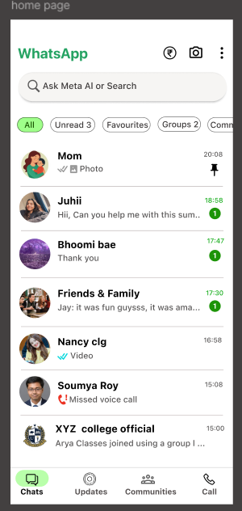

# 💬 WhatsApp AI UI Clone

<p align="center">
  <b>A modern WhatsApp AI mobile application UI/UX concept designed in Figma.</b><br>
  Inspired by WhatsApp's clean interface while showcasing interactive prototyping, smooth animations, and intuitive mobile user experience.
</p>

<p align="center">
<a href="https://www.figma.com/proto/EjdqUGtnsxSnDd5UcwPv0r/clone-ui?node-id=144-85&p=f&t=pniCjPqqGsCwgpx2-1&scaling=scale-down&content-scaling=fixed&page-id=5%3A2&starting-point-node-id=140%3A80">

</a>
</p>

---

# 📖 About the Project

**WhatsApp AI UI Clone** is a modern mobile UI/UX concept created entirely in **Figma**. The project recreates a WhatsApp-inspired interface while integrating a clean AI-focused experience through interactive prototyping.

The design emphasizes minimalism, smooth navigation, realistic mobile layouts, and engaging micro-interactions to deliver a polished user experience.

---

# 🎯 Project Goals

- Recreate a modern WhatsApp-inspired interface
- Practice mobile UI/UX design principles
- Build an interactive Figma prototype
- Explore micro-interactions and animations
- Create a clean and intuitive messaging experience

---

# ✨ Features

- 🚀 Animated Splash Screen
- 💚 WhatsApp Logo Bounce Animation
- 🤖 AI-Inspired Home Screen
- 💬 Modern Chat Interface
- 📱 Pixel-Perfect Mobile Layout
- ↔️ Horizontal Scrolling
- 🎬 Interactive Prototype
- 🎨 Clean Minimal Design

---

# 🎨 UX & Prototype Interactions

This prototype includes multiple interactive elements to simulate a realistic mobile application experience.

- 💚 Bounce animation on the WhatsApp logo during app launch
- 🚀 Smooth transition from Splash Screen to Home Screen
- ↔️ Horizontal scrolling for content navigation
- 👆 Interactive navigation between screens
- ⚡ Smooth prototype flow
- 📱 Realistic mobile application presentation

---

# 🛠️ Design Tools

- Figma
- Auto Layout
- Components
- Variants
- Interactive Prototyping
- Smart Animate

---

# 💼 Skills Demonstrated

- UI Design
- UX Design
- Mobile App Design
- Interactive Prototyping
- Auto Layout
- Smart Animate
- Components
- Variants
- Horizontal Scrolling
- Micro-interactions
- Visual Hierarchy
- Typography
- Color Theory
- Design Systems

---

# 📸 Project Screens

## 🚀 Splash Screen



---

## 💚 Logo Bounce Animation



---

## 💬 WhatsApp AI Home Screen



---

# 🎥 Prototype Walkthrough

A complete interactive prototype walkthrough is included in this repository.

**File:** `assets/prototype-demo.mp4`

---

# 🔗 Live Figma Prototype

### Explore the interactive prototype here

https://www.figma.com/proto/EjdqUGtnsxSnDd5UcwPv0r/clone-ui?node-id=144-85&p=f&t=pniCjPqqGsCwgpx2-1&scaling=scale-down&content-scaling=fixed&page-id=5%3A2&starting-point-node-id=140%3A80

---

# 📂 Repository Structure

```
whatsapp-ai-ui-clone
│
├── assets/
│   ├── splash-screen.png
│   ├── logo-animation.png
│   ├── home-screen.png
│   └── prototype-demo.mp4
│
└── README.md
```

---

# 🚀 Future Improvements

- Individual Chat Screen
- AI Conversation Interface
- Voice Message UI
- Profile & Settings Screen
- Dark/Light Theme Toggle
- Notifications UI
- Animated Chat Transitions
- Enhanced Micro-interactions
- AI Assistant Features

---

# 👩‍💻 Designed By

## Sakshi Bari

**Computer Engineering Student • UI/UX Designer • Frontend Enthusiast**

---

# 🌐 Connect With Me

**GitHub**

https://github.com/SakshiBari18

**LinkedIn**

https://www.linkedin.com/in/sakshibari-/

---

## ⭐ Support

If you like this project, consider giving it a ⭐ on GitHub.

Your support motivates me to continue designing and sharing more UI/UX projects.

---

> **Disclaimer:** This project is a UI/UX design concept created for educational and portfolio purposes. It is inspired by the WhatsApp interface and is not affiliated with or endorsed by WhatsApp.

---

<p align="center">
Designed using Figma
</p>
